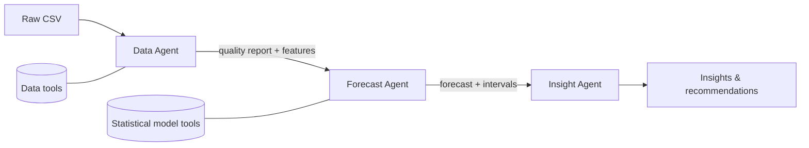

# LLM Agentic Forecasting: Walmart Weekly Sales

Does an LLM-based multi-agent system forecast retail sales better than traditional methods, or at least explain them better? This project tests that question on the Walmart 45-store weekly sales dataset.

> **Status:** 🚧 In progress. Results below are placeholders and will be filled in as experiments are completed.

---

## Table of Contents
- [Objective](#objective)
- [Hypotheses](#hypotheses)
- [Dataset](#dataset)
- [Approach](#approach)
- [Multi-Agent Architecture](#multi-agent-architecture)
- [Evaluation Methodology](#evaluation-methodology)
- [Results](#results)
- [Project Structure](#project-structure)
- [Getting Started](#getting-started)
- [Roadmap](#roadmap)
- [Limitations](#limitations)
- [License](#license)

---

## Objective

Compare **traditional forecasting methods** against **LLM-based approaches**, including a three-agent pipeline (Data Agent, Forecast Agent, Insight Agent), for weekly sales forecasting, and measure whether the LLM approach adds measurable value in accuracy, explainability, or both.

## Hypotheses

Defined before running experiments to keep the evaluation honest:

| # | Hypothesis | Supported if... |
|---|------------|-----------------|
| **H1** | LLM-only forecasting is competitive with traditional models | Error is comparable to baselines with no model training |
| **H2** | A **hybrid** (statistical forecast + LLM agent contextual adjustment) beats either alone | Lower error than both, especially on holiday or anomalous weeks |
| **H3** | The Insight Agent produces more useful, grounded explanations than a standard report | Higher rubric scores, and all cited numbers trace back to the data |

Negative results will be reported too.

## Dataset

**Walmart Sales Dataset of 45 Stores** (weekly sales, Feb 2010 to Oct 2012).

| Property | Value |
|----------|-------|
| Rows | 6,435 |
| Stores | 45 |
| Weeks per store | 143 (5 Feb 2010 to 26 Oct 2012) |
| Missing values | None |
| Date format | `dd-mm-yyyy` |

| Column | Description |
|--------|-------------|
| `Store` | Store ID (1 to 45) |
| `Date` | Week start date |
| `Weekly_Sales` | **Target variable** |
| `Holiday_Flag` | 1 if the week contains a major holiday (10 such weeks in the data) |
| `Temperature` | Regional temperature (°F) |
| `Fuel_Price` | Regional fuel price |
| `CPI` | Consumer Price Index |
| `Unemployment` | Regional unemployment rate |

Place the CSV at `data/raw/walmart-sales-dataset-of-45stores.csv`.

## Approach

### Traditional arm (baselines)
1. Seasonal naive (same week last year)
2. Holt-Winters / ETS
3. SARIMAX (with exogenous variables)
4. LightGBM with lag features

### LLM arm
1. **LLM-only**: recent history is passed as text and the model forecasts the next 12 weeks
2. **Multi-agent pipeline** (below)
3. *(Optional)* Time-series foundation model (e.g. Chronos) as a middle ground

## Multi-Agent Architecture



| Agent | Responsibility |
|-------|----------------|
| **Data Agent** | Loads and validates data, detects outliers and holiday effects, computes summaries and features |
| **Forecast Agent** | Runs statistical models via tools, then decides whether and how to adjust forecasts using context |
| **Insight Agent** | Explains drivers, risks, and recommended actions, citing the underlying numbers |

**Design principle:** the LLM never does arithmetic. All calculations are done by Python tools; the LLM decides which tools to call and interprets the results.

## Evaluation Methodology

- **Rolling-origin backtesting**: 12-week-ahead forecasts from multiple cut-off dates (no single train/test split)
- **Metrics:** MAE, RMSE, sMAPE, MASE
- **Slices:** all weeks / holiday weeks / non-holiday weeks / by store size
- **Cost metrics:** tokens, latency, and API cost per forecast
- **Significance:** paired comparison across stores (Wilcoxon signed-rank test)
- **Insight quality:** rubric-based scoring plus a grounding check (every number cited must match the data)

## Results

*To be completed.*

| Method | MAE | RMSE | sMAPE | MASE | Holiday-week MAE | Cost / forecast |
|--------|-----|------|-------|------|------------------|-----------------|
| Seasonal naive | - | - | - | - | - | - |
| ETS | - | - | - | - | - | - |
| SARIMAX | - | - | - | - | - | - |
| LightGBM | - | - | - | - | - | - |
| LLM-only | - | - | - | - | - | - |
| Multi-agent (hybrid) | - | - | - | - | - | - |

## Project Structure

```
llm-agentic-forecasting/
├── data/
│   ├── raw/                  # original CSV
│   └── processed/
├── notebooks/
│   ├── 01_eda.ipynb
│   └── 02_baseline_results.ipynb
├── src/
│   ├── data/                 # loader, rolling-origin splits
│   ├── baselines/            # naive, ETS, SARIMAX, LightGBM
│   ├── agents/               # data_agent, forecast_agent, insight_agent
│   ├── tools/                # Python functions the agents call
│   ├── evaluation/           # metrics
│   └── run_experiment.py
├── prompts/                  # versioned agent prompts
├── results/                  # forecasts, metrics, plots
├── docs/
│   └── experiment_design.md
├── tests/
├── .env.example
├── requirements.txt
└── README.md
```

## Getting Started

### Prerequisites
- Python 3.10+
- An Anthropic API key (for the LLM arm)

### Installation

```bash
git clone https://github.com/YOUR-USERNAME/llm-agentic-forecasting.git
cd llm-agentic-forecasting

python -m venv venv
source venv/bin/activate        # Windows: venv\Scripts\activate
pip install -r requirements.txt
```

### Configuration

```bash
cp .env.example .env
# then edit .env and add your key:
# ANTHROPIC_API_KEY=your-key-here
```

> ⚠️ Never commit `.env`. It is listed in `.gitignore`.

### Run

```bash
# Explore the data
jupyter notebook notebooks/01_eda.ipynb

# Run baselines (example)
python -m src.run_experiment --method seasonal_naive --stores 1 2 3 4 5

# Run the multi-agent pipeline on a small subset first
python -m src.run_experiment --method multi_agent --stores 1 2 3 4 5
```

*(Commands will be finalized as the code is written.)*

## Roadmap

- [ ] EDA: seasonality, holiday effects, store comparison
- [ ] Evaluation harness (rolling-origin folds + metrics)
- [ ] Traditional baselines
- [ ] LLM-only forecaster (small subset of stores)
- [ ] Data Agent
- [ ] Forecast Agent (hybrid)
- [ ] Insight Agent
- [ ] Full 45-store run and significance testing
- [ ] Final write-up with charts

## Limitations

- **Short history:** under 3 years of data, so only about 2 full yearly cycles are available to learn seasonality.
- **Holiday coverage:** Thanksgiving and Christmas appear only in 2010 and 2011, so they cannot be used as a held-out test.
- **Possible training-data leakage:** LLMs may have encountered this public dataset. Mitigation: store IDs and dates are anonymized/shifted in LLM prompts.
- **Cost:** LLM evaluation across 45 stores and many folds is expensive, so early experiments use a store subset.

## License

MIT. See [LICENSE](LICENSE).

## Acknowledgements

Dataset: Walmart Store Sales (publicly available on Kaggle).
